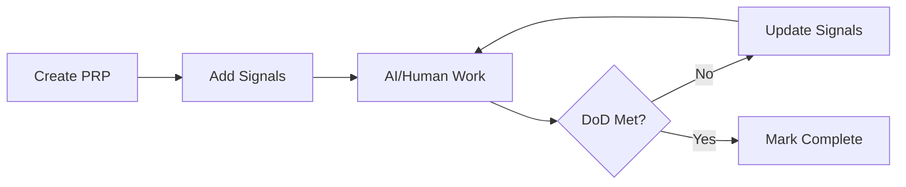

# What is PRP (Product Request Prompt)?

> **Source:** [PRP Repository](https://github.com/dcversus/prp) | **License:** MIT

**PRP** stands for **Product Request Prompt** - a revolutionary methodology that combines context-driven development with emotional signal systems to enhance human-AI collaboration in software projects.

## Core Concepts

### 1. Context-Driven Development

PRP emphasizes **context over commands**. Instead of issuing discrete instructions, developers and AI agents work within shared context documents called PRPs.

**Key Principle:**
> "Context is king. A well-defined PRP contains all the information needed for both humans and AI to understand the 'why' behind the 'what'."

**Reference:** [Context-Driven Development](12-context-driven-development)

### 2. Emotional Signal System

PRP introduces **14 emotional/state indicators** that guide work prioritization and team communication:

- 🔴 **BLOCKED** - Cannot proceed (Priority: 10)
- 🟡 **ATTENTION** - Needs review (Priority: 8)
- 🟢 **PROGRESS** - Moving forward (Priority: 5)
- 💙 **ENCANTADO** - Delighted with result (Priority: 1)

**Reference:** [Signal System](11-signal-system)

### 3. Flat PRP Structure

All PRPs follow a **flat directory structure** with outcome-focused naming:

```
PRPs/
├── PRP-001-bootstrap-cli-created.md
├── PRP-002-landing-page-deployed.md
└── PRP-003-telegram-notifications-enabled.md
```

**Naming Convention:** `PRP-XXX-what-will-change.md`

### 4. Human as Agent

In PRP methodology, **humans are subordinate agents** to the AI orchestrator, not the reverse. This inverts traditional software development hierarchy.

**Reference:** [Human as Agent](13-human-as-agent)

## Why PRP?

### Traditional Approach vs PRP

| Traditional | PRP |
|------------|-----|
| Task-based instructions | Context-driven narratives |
| Manual prioritization | Signal-based prioritization |
| Human commands AI | AI orchestrates humans |
| Scattered documentation | Centralized PRP documents |

### Benefits

1. **Better Context Preservation** - All project context in one place
2. **Intelligent Prioritization** - Signal strength guides work order
3. **Enhanced Collaboration** - Shared language between humans and AI
4. **Self-Documenting** - PRPs serve as both plan and documentation

## PRP Lifecycle



## Getting Started with PRP

### For Non-Developers

1. **Learn the Signal System** - Understand emotional indicators
2. **Read Existing PRPs** - See examples in action
3. **Practice Writing** - Start with simple PRPs
4. **Use the CLI** - Generate projects with [@dcversus/prp](20-prp-cli-installation)

### For Developers

1. **Install PRP CLI** - `npm install -g @dcversus/prp`
2. **Study AGENTS.md** - Learn AI agent guidelines
3. **Create Your First PRP** - Follow the template
4. **Contribute** - See [How to Contribute](30-how-to-contribute)

## Real-World Example

**PRP-001-bootstrap-cli-created.md** from the PRP project itself:

```markdown
# PRP-001: Bootstrap CLI Created

## Problem
Need a CLI tool to scaffold projects with PRP methodology baked in.

## Outcome
Working CLI that generates React, FastAPI, TypeScript projects with:
- Pre-configured PRP directory structure
- Signal system integration
- Comprehensive documentation templates

## Progress Log
| Role | DateTime | Comment | Signal |
|------|----------|---------|--------|
| Developer | 2025-10-28 | CLI scaffolding complete | PROGRESS (5) |
| Tester | 2025-10-28 | All 18 tests passing | ENCANTADO (1) |
```

## Further Reading

- [PRP Overview](10-prp-overview) - Detailed methodology guide
- [Signal System](11-signal-system) - Complete signal reference
- [Research Papers](50-research-papers) - Academic foundations
- [PRP Repository](https://github.com/dcversus/prp) - Source code and examples

---

**Next:** Learn about the [Signal System](11-signal-system) →
